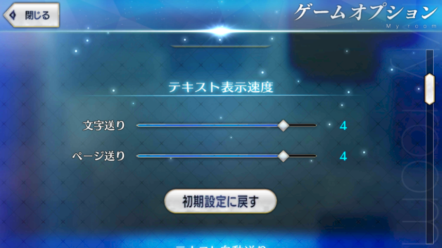

## ¿El texto es demasiado rápido o lento?

Puede modificar la velocidad de texto en el apartado de configuración del juego:

- Opción de Arriba: Velocidad de Texto
- Opción de Abajo: Velocidad de Desplazamiento del Texto

## ¿Funciona en NA?

Por supuesto, el Servidor NA es compatible con traducciones al Español y PTBR a partir de la versión 2.0.0 de Rayshift.io Translate.

## Quiero usar el parche, pero tengo miedo, ¿Es posible que me baneen?

No debido a la siguiente razones, no van ha prohibirte jugar el juego:

- El juego no detecta ni puede detectar nada de lo que hace esta aplicación, porque no tiene un sistema para ello.
- Diseñar un sistema para monitorizar los archivos temporales, es costoso, inútil y puede traer bugs, ninguna empresa lo haría, ya que no hay merito para ello.

- Nuestra App no requiere Root (Por ende es segura de usar)
- Actualmente esta aplicación no viola ninguno de los términos de servicio, los cuales solo sancionan específicamente la modificación de la data interna del APK.
- Esta aplicación no modifica el APK.
- Concretamente modifica el texto en caché de su tarjeta SD o almacenamiento interno, instalando ahí la traducción (Por ello es que al actualizar FGO, no se pierde la traducción, ya que la cache esta alojada fuera de la data interna del APK)
