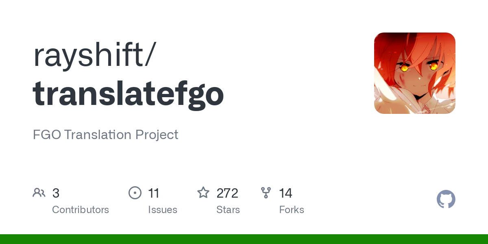

[Instalación](install.md){ .md-button .md-button-center }
[Pregunta Frecuentes](faq.md){ .md-button .md-button-center }

# Rayshift Translate App

Esta aplicación ofrece traducciones hechas por Máquina/MTL (Deepl) y manuales de eventos e historias recientes (al inglés) del juego en el Servidor
JP y traducciones manuales al Español de la historia principal y diversos Eventos
e Interludios, esta última utilizando la traducción oficial del Servidor NA. Además,
traducciones al Francés, Indonesio, Ruso, Portugués y Árabe.

